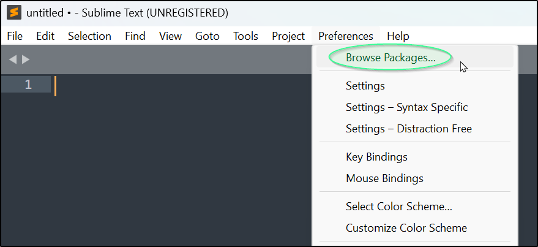
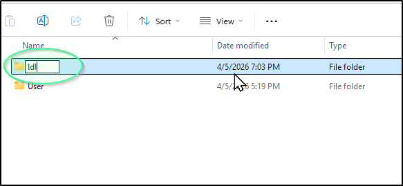
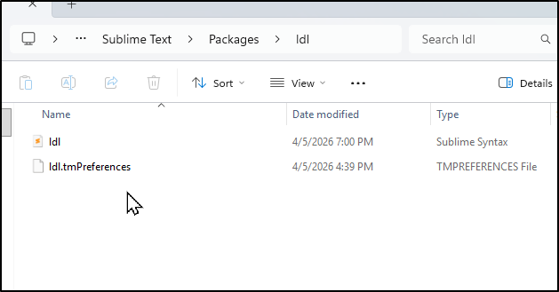
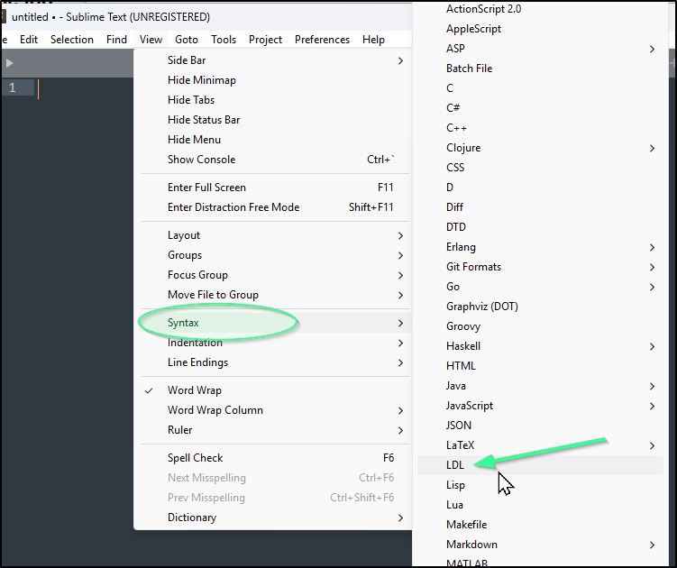
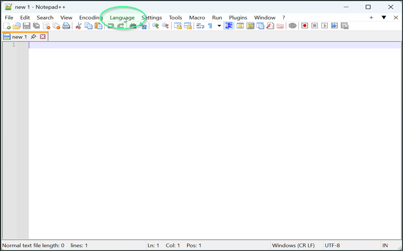
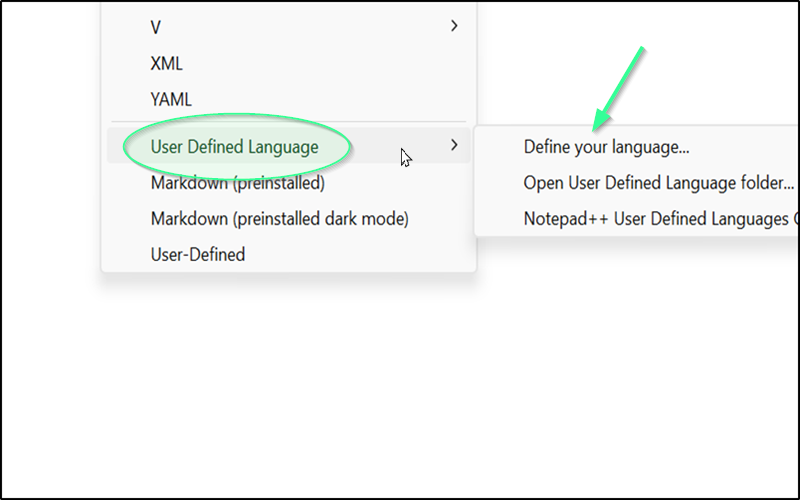
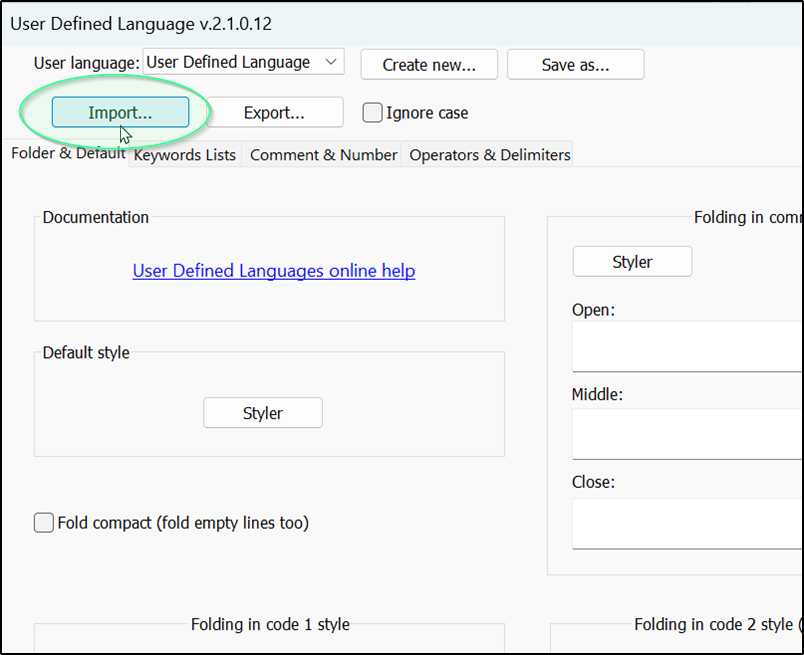
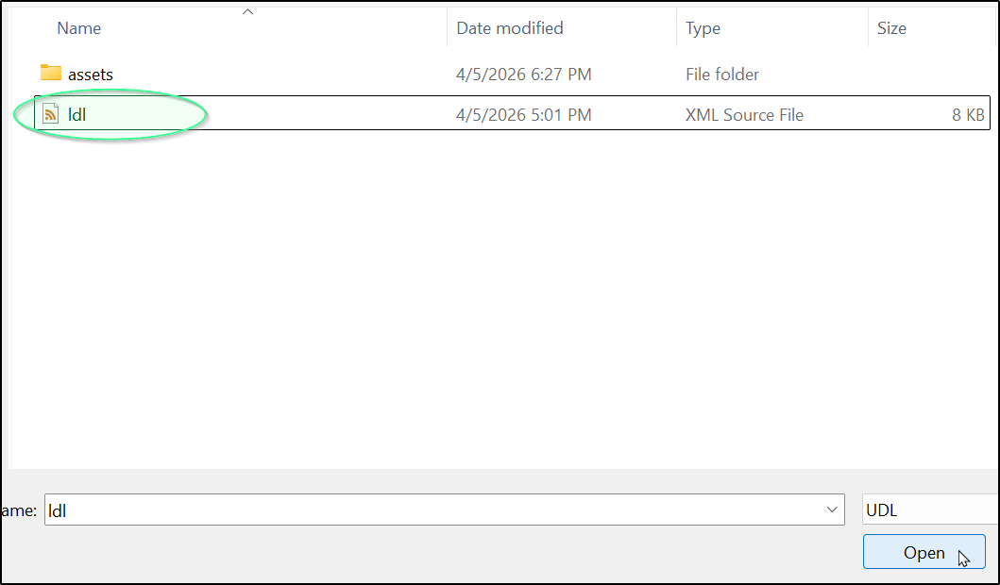
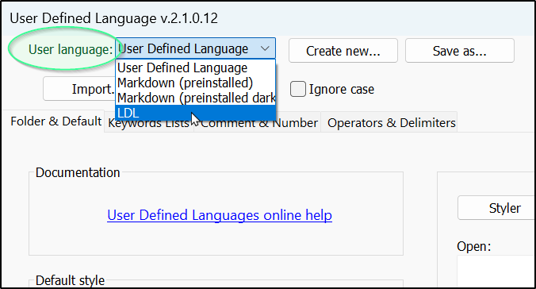

# LDL

Syntax highlighting configuration for Logic Development Language (**LDL**), a proprietary language developed by Unisys.
LDL has its roots in LINC (Logic and Information Network Compiler), a fourth-generation programming language used on Unisys systems. LDL was introduced with the Unisys Enterprise Application Environment (EAE), a platform for building enterprise applications targeting Unisys ClearPath systems, Windows, and various Unix and Linux platforms. Keywords were sourced directly from the official Unisys language documentation.

## Supported Editors:
- Sublime Text (.sublime-syntax)
- Notepad++ (.XML)

## Support TBA
- VSCode (.tmLanguage.json)

## Installation
### Sublime Text
1. Clone the ldl/sublime-text repo to your local machine. Take note of where you cloned it to or the location you downloaded it to.
2. Open Sublime Text.
3. Navigate to Preferences -> Browse Packages

4. This will open a new file explorer window. Use it to create a new folder called "ldl" in this directory. This will contain all the configurations for the LDL syntax.

5. Copy "ldl.sublime-syntax" and "ldl.tmPreferences" into this new "Packages\ldl" folder.

6. Your Sublime Text editor should be enabled to use LDL syntax. You will be able to see it listed as "LDL" in the slideout dropdown menu View -> Syntax, labeled alphabetically. You can start using the LDL syntax on documents by naming them with the .ldl file extension or selecting the Syntax from the Syntax Menu.

### Notepad++
1. Clone the ldl/notepad-plus-plus repo to your local machine. Take note of where you cloned it to or the location you downloaded it to.
2. Open Notepad++.
3. Navigate to the menu bar and click Language.

4. Slide your mouse down to hover on "User Defined Language" which should open a separate menu of options. Click "Define your Language..." and a new window will pop up.

5. Click the "Import..." button. This will open a window that allows you to search for the repo you cloned in step 1.

6. Within that repo, select the ldl.xml file and click Open.

7. You should have a successful import. You will be able to see it listed as "LDL" in the dropdown menu labeled "User language" in the top left. You can close out of the window and start using the LDL syntax on documents by naming them with the .ldl file extension.

8. If the import failed, return to step 3 and try the step sequence again.

## Known Limitations
### Notepad++ — Comment Highlighting
LDL supports inline comments denoted by a colon (:), which comment out only the word or phrase directly following the colon rather than the remainder of the line. Due to constraints in the Notepad++ User Defined Language (UDL) system, which does not support regex-based token boundaries, comment highlighting in Notepad++ will highlight everything following a colon to the end of the line. This is a limitation of the UDL format and not a bug in the configuration itself. 
For accurate inline comment highlighting, use the Enterprise Application Environment (**EAE**) IDE.
### Sublime Text — Comment Highlighting
LDL supports inline comments denoted by a colon (:), which comments out only the word or phrase directly following the colon rather than the remainder of the line. Due to constraints in the Sublime Syntax system, comment highlighting in Sublime Text will highlight everything following a colon to the end of the line. This is a limitation of the format and not a bug in the configuration itself. It is due to the ability of the EAE editor to swap syntactic highlighting rules when the editor-processor encounters a named variable in the setup data list.
For accurate inline comment highlighting, use the Enterprise Application Environment (**EAE**) IDE.  
~